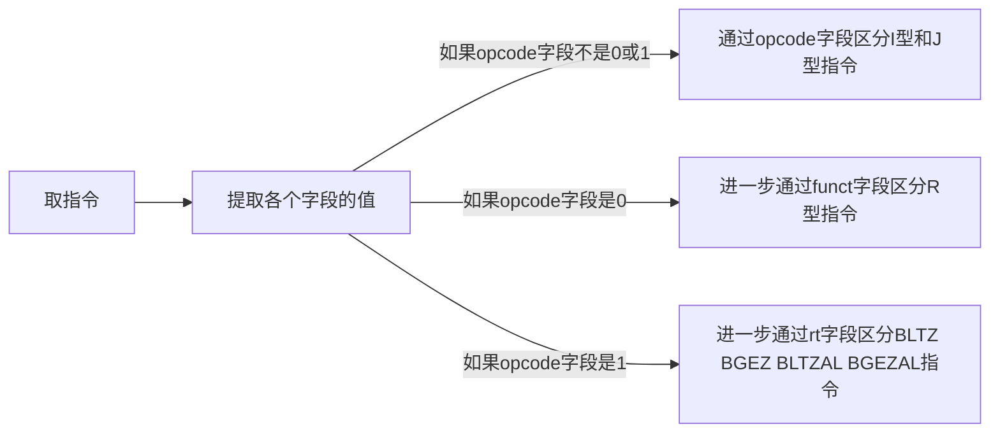

# 设计思路

## 读入流程

流程为：

- 首先，使用 `mem_read_32` **取出指令**，按照 R 型、I 型和 J 型三种类型的指令格式提取出指令对应部分字段的值，进而判断指令的类型。
- 根据指令的类型，以及其中的 opcode（R 型还有 funct 字段，特殊 I 型指令还有 rt 字段），**识别具体的指令，执行对应指令的操作**。
- 更新 PC 的值。

流程中最难的部分为根据指令中的 opcode（和 funct、rt 字段）判断是哪一种指令。为了判断具体的指令，应当**首先区分 R 型、I 型和 J 型指令**。

## R 型、I 型和 J 型的区分

接下来，对 R 型、I 型和 J 型三种类型的指令进行区分，MIPS 的手册上写得比较清楚：


注意到 R 型指令的操作码也就是 opcode 都是 0（经过查阅 MIPS 手册，本次仿真实验所需要实现的 R 型指令中的 opcode 都为 0），也就是说无法通过 opcode 区分 R 型指令，还需要借助 R 型指令的 funct 字段进行区分；而其他的 I 型指令（除了 BLTZ、BGEZ、BLTZAL、BGEZAL 四个指令以外，这四个指令的区分在下面介绍）和 J 型指令都可以通过 opcode 进行区分。

## 进一步的细分

需要注意，根据 MIPS 手册，**BLTZ、BGEZ、BLTZAL、BGEZAL 四个指令的 opcode 也是 1，需要再进一步地根据 rt 字段细分**。

因此，**总的判断流程**为：



## 代码的实现框架

### 宏定义

在代码中，由于我**主要通过 switch-case 语句**实现这些判断流程，为了使代码更加清晰易懂，我使用了**宏定义**：

```c
// R 型指令操作码：0
#define OP_RTYPE 0x00

// I 型指令
#define OP_BEQ 0x04
#define OP_BNE 0x05
#define OP_BLEZ 0x06
#define OP_BGTZ 0x07
#define OP_ADDI 0x08
#define OP_ADDIU 0x09
#define OP_SLTI 0x0A
#define OP_SLTIU 0x0B
#define OP_ANDI 0x0C
#define OP_ORI 0x0D
#define OP_XORI 0x0E
#define OP_LUI 0x0F
#define OP_LB 0x20
#define OP_LH 0x21
#define OP_LW 0x23
#define OP_LBU 0x24
#define OP_LHU 0x25
#define OP_SB 0x28
#define OP_SH 0x29
#define OP_SW 0x2B

// BLTZ BGEZ BLTZAL BGEZAL 这几个指令特殊，它们也没法通过 opcode 区分
#define OP_BSPECIAL 0x01

// J 型指令
#define OP_J 0x02
#define OP_JAL 0x03
```

上面是各指令 opcode 字段的定义，因为在本次实验中 R 型指令的 opcode 字段均为 0，所以统一进行宏定义。其他是查阅手册得到的指令 opcode 字段。

那么，对于 R 型指令，还需要进一步宏定义各种 R 型指令的 funct 字段：

```c
// R 型指令：funct 段
#define FUNCT_SLL 0x00
#define FUNCT_SRL 0x02
#define FUNCT_SRA 0x03
#define FUNCT_SLLV 0x04
#define FUNCT_SRLV 0x06
#define FUNCT_SRAV 0x07
#define FUNCT_JR 0x08
#define FUNCT_JALR 0x09
#define FUNCT_ADD 0x20
#define FUNCT_ADDU 0x21
#define FUNCT_SUB 0x22
#define FUNCT_SUBU 0x23
#define FUNCT_AND 0x24
#define FUNCT_OR 0x25
#define FUNCT_XOR 0x26
#define FUNCT_NOR 0x27
#define FUNCT_SLT 0x2A
#define FUNCT_SLTU 0x2B
#define FUNCT_MULT 0x18
#define FUNCT_MFHI 0x10
#define FUNCT_MFLO 0x12
#define FUNCT_MTHI 0x11
#define FUNCT_MTLO 0x13
#define FUNCT_MULTU 0x19
#define FUNCT_DIV 0x1A
#define FUNCT_DIVU 0x1B
#define FUNCT_JR 0x08
#define FUNCT_JALR 0x09
#define FUNCT_SYSCALL 0x0C
```

针对 4 个特殊的 I 型指令，还需要先宏定义其 rt 字段的值：

```c
// 特殊的跳转指令：rt 字段
#define RT_BLTZ 0x00
#define RT_BGEZ 0x01
#define RT_BLTZAL 0x10
#define RT_BGEZAL 0x11
```

这样，后续的 case 语句就好写很多了。

### 主体框架

代码的主体部分框架为：

```c
void process_instruction()
{
    /* execute one instruction here. You should use CURRENT_STATE and modify
     * values in NEXT_STATE. You can call mem_read_32() and mem_write_32() to
     * access memory. */
    uint32_t instruction = mem_read_32(CURRENT_STATE.PC);

	// 计算字段 op rs rt rd shamt funct imm target 等
    uint8_t op = instruction >> 26 & 0x3F;
    uint8_t rs = instruction >> 21 & 0x1F;
    uint8_t rt = instruction >> 16 & 0x1F;
    uint8_t rd = instruction >> 11 & 0x1F;
    uint8_t shamt = instruction >> 6 & 0x1F;
    uint8_t funct = instruction & 0x3F;
    uint16_t imm = instruction & 0xFFFF;
    uint32_t target = (instruction & 0x3FFFFFF) << 2;
    int32_t extended_imm = (int32_t)imm;
    uint32_t address = CURRENT_STATE.REGS[rs] + imm;

    /* 更新 PC，就连 SYSCALL 也一定会增加 4
     * "No registers are modified in either case,
     * except that PC is incremented to the next instruction as usual." */
    NEXT_STATE.PC = CURRENT_STATE.PC + 4;

    // 按 opcode 区分
    switch (op)
    {

    // R 型指令
    case OP_RTYPE:

        uint32_t funct = instruction & 0x3F;

        // 按 funct 字段区分
        switch (funct)
        {
        case FUNCT_SLL:
	        // 省略...
        }
        break;

	// 其他 I 型和 J 型指令的 opcode 以及具体更新操作
    case OP_J:
	    // 省略...

    // 特殊的跳转指令
    case OP_BSPECIAL:
        switch (rt)
        {
        case RT_BLTZ:
            // Branch on less than zero
            if ((int32_t)CURRENT_STATE.REGS[rs] < 0)
            {
                NEXT_STATE.PC += offset;
            }
            break;

        case RT_BGEZ:
            // Branch on greater than or equal to zero
            printf("%d: %x\n", rs, CURRENT_STATE.REGS[rs]);
            if ((int32_t)CURRENT_STATE.REGS[rs] >= 0)
            {
                NEXT_STATE.PC += offset;
            }
            break;

        case RT_BLTZAL:
            NEXT_STATE.REGS[31] = CURRENT_STATE.PC + 4;
            if ((int32_t)CURRENT_STATE.REGS[rs] < 0)
            {
                NEXT_STATE.PC += offset;
            }
            break;

        case RT_BGEZAL:
            NEXT_STATE.REGS[31] = CURRENT_STATE.PC + 4;
            if ((int32_t)CURRENT_STATE.REGS[rs] >= 0)
            {
                NEXT_STATE.PC += offset;
            }
            break;
        }
        break;

    default:
        // 非法指令，什么也不做
    }
}
```

其中各个 case 语句内部主要是使用指令字段值、CURRENT_STATE 的各个寄存器和内存，更新 NEXT_STATE 的各个寄存器和内存。

这样，逐一完善各个 case 语句，即可实现 process_instruction 函数。中间由于涉及到字节、半字的读取和写入，我还自己实现了 mem_read_8 等函数，这些函数主要调用了 shell. C 文件中实现的 mem_read_32 () 和 mem_write_32 () 来访问内存。

完整代码链接见文件夹中的 src 目录，也可参考 [natsunoshion/Computer-Architecture (github.com)](https://github.com/natsunoshion/Computer-Architecture)。

## 其他改进

首先，QtSpim 并不好用，我在尝试后发现频频报错。经过查阅报错资料，我在 Stack Overflow 上了解到 **Mars 更适合将 MIPS 汇编语言转为机器码**。（参考：[assembly - How to get the machine code from Mars simulator - Stack Overflow](https://stackoverflow.com/questions/60944579/how-to-get-the-machine-code-from-mars-simulator)）首先，在官网上下载 Mars4_5. Jar，安装 Java，然后将此 jar 文件复制到 inputs 文件夹下，并新建文件 `MarsCompiler.java`：

```java
import mars.*;
import java.util.*;

public class MarsCompiler
{
  public static void main(String... args) throws Exception
  {
      if (args.length != 1)
      {
          System.err.println("Usage: java MarsCompiler input");
          System.exit(1);
      }


      Globals.initialize(false);

      MIPSprogram program = new MIPSprogram();
      program.readSource(args[0]);

      ErrorList errors = null;

      try
      {
        program.tokenize();
        errors = program.assemble(new ArrayList(Arrays.asList(program)), true, true);
      }
      catch (ProcessingException e)
      {
        errors = e.errors();
      }

      if (errors.errorsOccurred() || errors.warningsOccurred())
      {
          for (ErrorMessage em : (ArrayList<ErrorMessage>)errors.getErrorMessages())
          {
              System.err.println(String.format("[%s] %s@%d:%d %s",
                em.isWarning() ? "WRN" : "ERR",
                em.getFilename(), em.getLine(), em.getPosition(),
                em.getMessage()));
          }
          System.exit(2);
      }

      for (ProgramStatement ps : (ArrayList<ProgramStatement>)program.getMachineList())
        System.out.println(String.format("%08x %08x", ps.getAddress(), ps.getBinaryStatement()));
      
  }

}
```

然后在 inputs 文件夹下打开终端，输入 `javac -cp Mars4_5.jar MarsCompiler.java`，即可安装 MarsCompiler。最后，使用命令 `java -cp Mars4_5.jar MarsCompiler xxx.s` 即可。

由于输入命令（还涉及到切换文件目录）太麻烦，我在 lab1 文件夹目录下又创建了一个 **Makefile**，内容为：

```make
sim:
	gcc -g -O2 ./src/shell.c ./src/sim.c -o ./src/sim

as:
	java -cp ./inputs/Mars4_5.jar MarsCompiler ./inputs/$(arg1).s

run:
	src/sim inputs/$(arg1).x

.PHONY: clean
clean:
	rm -rf ./src/*.o ./src/*~ ./src/sim
```

这样，以 `addiu.s` 为例，我们只需要在 lab1 文件夹下打开终端，输入 ` make sim ` 生成 sim 可执行文件（ELF 格式），然后输入 ` make as arg1=addiu ` 生成机器码，最后输入 ` make run arg1=addiu ` 即可运行。

# 结果验证

## 额外编写的程序

由于手册要求：

>also write one or more programs using all of the required MIPS instructions that are listed in the table above

所以这里为了进一步验证结果，我自己编写了另一个汇编代码文件，**该汇编代码包括了表中所有的 53 条指令**。代码如下：（更细节的控制流在下面的测试部分解释）

```mipsasm
.text
main:
  addi $1, $0, 1 # $1 = 1  
  addi $2, $0, 2 # $2 = 2
  slti $3, $1, 5 # $3 = 1, $1 < 5
  bne $3, $0, L2 # 跳转执行,因为$3!=0

L1:
  addi $1, $1, 3 # 第一次$1 = 4,第二次$1 = 7
  sltiu $4, $1, 5 # 第一次$4 = 1, $1 unsigned < 5,第二次$4 = 0, $1 unsigned >= 5
  beq $4, $0, L3 # 第一次不跳转执行,因为$4==1,第二次跳转执行,因为$4==0

L2:
  andi $5, $1, 2 # 第一次第二次都相当于$5 = 0, $1和2按位与($1第一次为1,第二次为4)
  beq $5, $0, L1 # 第一次第二次都跳转执行,因为$5==0 

L3:
  ori $6, $1, 1 # $6 = 7, $1和1按位或
  xor $7, $6, $1 # $7 = 0, $6和$1按位异或
  bne $7, $0, L5 # 不跳转执行,因为$7==0

L4:
  lui $2, 0x1000 # 设置基址
  lui $8, 0x1234 # $8 = 0x12340000
  li $9, 0x13 # $9 = 0x13,li是伪指令
  li $10, 0x14 # $10 = 0x14
  li $12, 0x12 # $12 = 0x12
  sb $9, 1($2) # 存储字节
  sh $10, 2($2) # 存储半字
  sw $12, 4($2) # 存储字
  lb $9, 1($2) # 加载字节
  lbu $11, 1($2) # 无符号加载字节
  lh $10, 2($2) # 加载半字  
  lhu $13, 2($2) # 无符号加载半字
  lw $12, 4($2) # 加载字
  bltzal $1, L5 # 如果$1<0调用L5
  addi $1, $1, 1 # $1加1

L5: 
  jal L6 # 跳转连接调用L6
  li $v0, 10 # $v0 = 10
  syscall

L6:
  mult $1, $2 # 乘法,$1 = 8
  mflo $3 # 取乘法结果
  mfhi $4 # 取乘法高位结果
  div $3, $1 # 除法
  mflo $5 # 取除法结果
  add $6, $1, $2 # 加法
  addu $7, $1, $2 # 无溢出加法
  sub $8, $1, $2 # 减法
  subu $9, $1, $2 # 无溢出减法
  sllv $10, $1, $2 # 逻辑左移变址
  srlv $11, $1, $2 # 逻辑右移变址
  srav $13, $1, $2 # 算术右移变址
  sll $12, $1, 10 # 逻辑左移立即数
  srl $15, $1, 5 # 逻辑右移立即数
  sra $16, $1, 3 # 算术右移立即数
  and $17, $1, $2 # 按位与
  or $18, $1, $2 # 按位或
  xor $19, $1, $2 # 按位异或
  nor $19, $1, $2 # 按位或非
  slt $19, $1, $2 # 设置小于
  sltu $19, $1, $2 # 无符号设置小于
  multu $1, $2 # 无符号乘法
  divu $1, $2 # 无符号除法  
  xori $1, $1, 1 # $1和1按位异或立即数
  mthi $3 # 设置乘法高位寄存器
  mtlo $4 # 设置乘法低位寄存器

L7:
  addiu $3, $31, 0 # 保存此前$31的值
  bgez $1, L9 # 跳转执行,因为$1 >= 0

L8: 
  bgezal $1, L8 # 如果$1 >= 0,跳转链接执行

L9:
  blez $1, L10 # 如果$1 <= 0,跳转执行
  addiu $1, $1, -1 # $1 -= 1
  b L9 # 跳转至L9,循环

L10:
  bgtz $1, L12 # 不跳转执行,因为$1 = 0

L11: 
  bltz $1, L10 # 不跳转执行,因为$1 = 0

L12:
  la $2, L13 # 将L13地址加载到$2,这是一个伪指令
  jalr $2 # 跳转寄存器链接

L13:
  addiu $31, $3, 0 # 还原$31 
  jr $31 # 返回
```

## 测试

出于篇幅考虑，上面的程序已经写得非常详细了，因此**以上述程序为例进行测试验证**。已有样例的执行结果不再放出。同时，不可能把所有的执行过程和 `rdump` 结果全部放在实验报告中，因此这里**主要给出每一个基本块的运行结果**，实际测试流程为依次 `run 1` 并通过命令 `rdump` 观察寄存器。首先运行 L1 前的代码：


接着，逐步 `run 1` 并 `rdump` 观察寄存器，在第二次执行到 L1 的末尾时，寄存器如下：


可以看到 `$1` 已经为 7 了。再 `run 1` 就到 L3 处的指令了。

逐步执行 L3 中的指令：


看出 `$6 = 7` 且 `$7 = 0 `。

接下来执行 L4 部分，注意，编写的汇编代码中有伪指令 li 和 la，分别是加载立即数和加载地址，**它们在经过 MARS 汇编之后会翻译为已经实现的其他指令**，所以无需担心。L4 部分较长，先运行 sw 部分：


可以看出 `li` 伪指令生效，且应当将数据存放在了内存中。接下来运行后半部分：（到 `bltzal` 指令前）


这样，刚刚的几个寄存器值没变化，且 `$11` 和 `$13` 中也从内存中加载出数据了，因此正确。

现在再执行两条语句，看出没有跳转，因为 `$1>0`，合理。现在 `$1` 自增 1 后变为 8 了：


然后程序跳转至 L5，随后 `jal` 到了 L6。L6 包括很多算术运算，运行结束后寄存器如下：


由于篇幅有限，这里对结果进行简要分析：

1. `mult $1, $2` 进行有符号乘法,此时 `$1=8, $2=10`, 所以得到结果 64,存入 LO 寄存器。
2. `mfhi $4` 取出高 32 位存入 `$4`,因为结果小于 32 位,所以 `$4 = 0`。
3. `mflo $3` 取出低 32 位存入 `$3`,所以 `$3 = 64`。
4. `div $3, $1` 进行有符号除法,64 / 8 = 8,商存入 `LO`,余数存入 `HI`。所以 ` LO = 8, HI = 0 `。
5. `mflo $5` 取出商 8 存入 `$5`。
6. `add $6, $1, $2` 有符号加法,8 + 10 = 18,所以 `$6 = 18`。
7. `addu $7, $1, $2` 无符号加法,也是 8 + 10 = 18,所以 `$7 = 18`。
8. `sub $8, $1, $2` 有符号减法,8 - 10 = -2,但以补码表示,所以 `$8 = 0xfffffffe`。
9. `subu $9, $1, $2` 无符号减法,8 - 10 = fffffff8,所以 `$9 = 0xfffffff8`。
10. 位移指令将 `$1` 的值按 `$2` 指定的位数进行位移,所以结果正确。
11. 逻辑与或指令将 `$1` 和 `$2` 进行位运算,结果正确。
12. 比较指令比较 `$1` 和 `$2` 的大小,设置结果标志,所以 `$19 = 1` 表示 `$1 < $2`。
13. 乘除指令同理,进行无符号运算。
14. `xori` 按位异或立即数,将 `$1` 异或 1 得到反码结果 9。
15. `mthi` 和 `mtlo` 设置 `HI` 和 `LO` 寄存器的值，分别为 `$3` 和 `$4`，与实际相符。

说明结果无误。

执行 L7 中的指令 `addiu $3, $31, 0`：


成功。然后程序会跳转到 L9 不断循环，一直将 `$1` 减到 0：（为了方便观察，我将指令机器码打印了出来）


最后，由于 `$1==0`，跳转到了 L10，然后 L10 和 L11 都不会跳转。在 L12 中指令 `la $2, L13`：


地址也成功地加载了。L13 还会把 `$31` 还原：


最后程序返回到 `li $v0, 10` 和 `syscall`，结束运行：


综上，**结果正确**。

